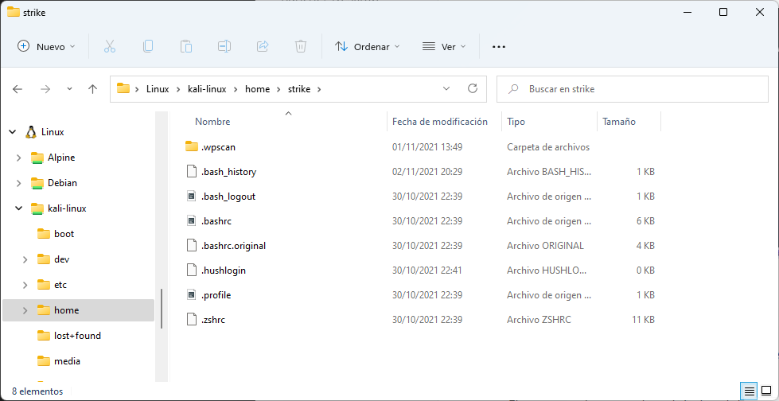

 El subsistema de linux en windows se introdujo hace unos años en windows 10 pero sus primeras versiones tenían ciertas limitaciones y no acababa de funcionar como se esperaba. Personalmente, con WSL2 y Windows 11 creo que ha llegado a ofrecer el funcionamiento que realmente se esperaba de el. Dentro vídeo:
https://youtu.be/p04dRcQh2VM 

 ## Ventajas y desventajas
En el vídeo analizo las principales ventajas que ofrece y alguna que otra desventaja por el camino. Los principales puntos a destacar son:

* El consumo de memoria es inferior al de una máquina virtual. Aunque mayor que una solución nativa, windows virtualiza un kernel linux que aprovechan y comparten las distintas distribuciones del subsistema.
* También sirve backend para aplicaciones como Docker Desktop o Rancher Desktop haciendolos más livianos que usándolos sober hyper-V.
* La integración con windows terminal es sencilla. Además, este nuevo terminal nos ofrece una interfaz limpia, personalizable y con una multitarea que ya le hacía falta. Nose vosotros pero a mi me encanta.
* Simplicidad en el uso de varios entornos, instalación, reseteo o borrado.
* La integración con VS Code de forma bidireccional es algo que me encanta. Ya no me molesto en instalar los lenguajes de programación o las herramientas de sistemas en windows, prácticamente todo lo uso sobre una distribución u otra en función de lo que necesite.
* Montaje del sistema de archivos. Aunque el acceso es más lento al ser dos sistemas de archivos diferentes, windows nos monta nuestro home (c:/users/pablo) en cada uno de los subsistemas. 
* Integración de los sistemas de archivos de las distribuciones en el explorador de windows.

Espero que os guste y os anime a sacarle más partido a las herramientas que nos ofrece windows. ¡Hasta el próximo!
