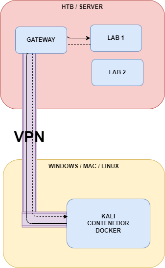

He hablado mucho de como hacer diversas acciones en docker y contenedores. Tampoco quiero que mi contenido sea monotemático pero
me han lanzando una sugerencia de vídeo y no me puedo resistir a abordar el tema.

Concretamente, el usuario pwnhun73r me sugirió utilizar contenedores para pentesting en laboratorios como HackTheBox o TryHackMe. Gracias por el apoyo y la sugerencia. Tu también puedes sugerir nuevo contenido desde [la sección de issues de esta página en GitHub](https://github.com/pabpereza/pabpereza/issues).

Hace tiempo que no me dedico al pentesting profesionalmente pero tampoco me gusta que se me oxide el tema. Youtube es muy restrictivo con el contenido del hacking por lo que, para este vídeo, me limitaré a plantear el entorno sin entrar en la explotación.


## ¿Por qué?
Esta es la pregunta del millón... ¿Por qué?¿Cuál es la necesidad?. Realmente las máquinas virtuales para esta labor igual son más prácticas que un contenedor, tienes tus copias de seguridad, tu interfaz, puedes conectarles hardware cómodamente (antenas, cables, etc) y puedes configurar los servicios que necesites.

Para los fanáticos de los contenedores como yo, es por amor de llevar la tecnología al límite. Hay que reconocer que los contenedores tienen sus ventajas. Fáciles de ejecutar, versionar y almacenar. Suficiente para justificar este vídeo.

## Retos
Tenemos dos retos a tener en cuenta basados en dos escenarios:

### Contenedor para pentesting de un sitio web público
Antes de nada recordad que el sitio deberá ser de vuestra propiedad o deberéis tener permiso para auditarlo. 


En este supuesto, accedemos a algún sitio público y queremos hacer pentesting. Para la parte de la enumeración no tendremos limitación alguna. El problema surge cuando queremos explotar un sitio. La mayoría de conexiones que intentaremos generar serán inversas y, por tanto, necesitaremos abrir puertos en el router.


Supongamos que hacemos las pruebas desde un servidor público también, como un VPS. En este caso, no tendremos problema para abrir puertos. Aunque no todo queda ahí, tendremos que natear al contenedor un rango de puertos para que el servidor pueda acceder a los servicios que estemos ejecutando en el contenedor.

Imaginaros que estamos escuchando una conexión con netcat en el puerto 4444. Deberíamos ejecutar el contenedor con ese puerto mapeado del host para que podamos capturar las conexiones desde del contenedor.

Esto podemos hacerlo así:

```bash
docker run -it -p 4444:4444 kalilinux/kali-rolling /bin/bash
```

### Contenedor para pentesting en un laboratorio privado
En este caso, la parte de acceso y enrutamiento es más sencillo dado que normalmente a los laboratorios de pentesting nos conectamos a través de una VPN, la cuál, nos crea un tunel directamente desde el contenedor al laboratorio.




La problemática viene por la parte del cliente VPN en los contenedores.

#### Limitaciones
La principal limitación es la acceso a las interfaces de red. En una máquina virtual virtualizas tanto software como hardware. En el caso de los contenedores, al ser procesos aislados, tenemos que lidiar con la problemática de crear interfaces de red para las VPN de algunos laboratorio.

Podemos levantar un contenedor con Kali Linux solventando estas limitaciones, usando el parámetro `--privileged` para que el contenedor tenga acceso a las interfaces de red del host y `--sysctl net.ipv6.conf.all.disable_ipv6=0` para que el contenedor tenga acceso a la red IPv6.

El comando completo sería:
```bash
docker run -it --privileged --sysctl net.ipv6.conf.all.disable_ipv6=0 kalilinux/kali-rolling /bin/bash
```

Así ya podríamos conectarnos a HackTheBox, por ejemplo.

## Vídeo 
Sin más preámbulos, dentro vídeo:
[](https://youtu.be/0GsiBPVRMyI)
