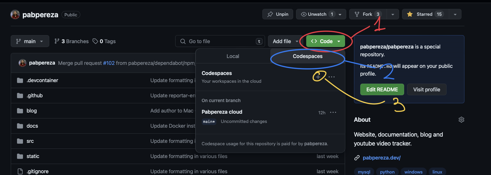
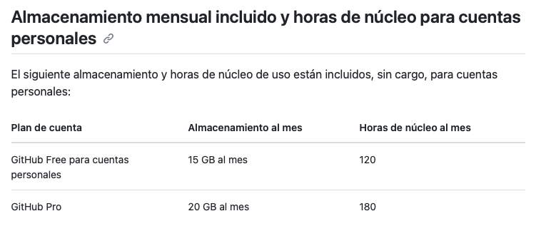
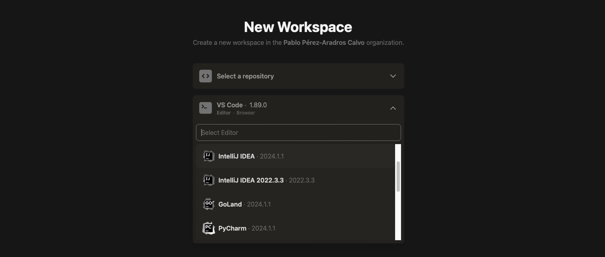

# Entornos de desarrollo remotos y gratuitos 
¡Hola! A raíz del [curso de Docker que estoy realizando](https://pabpereza.dev/docs/cursos/docker), algunos me habéis preguntado la posibilidad de seguirlo en Android o dispositivos móviles. Ya sea porque no tengamos un ordenador, los recursos necesarios para instalar docker, o simplemente, por no querer instalarlo en nuestro equipo, quería estudiar varias alternativas para montar un entorno de desarrollo remoto y totalmente gratuito.

<!-- truncate -->

Lo primero,  es que podremos evitar depender de un dispositivo en concretos, esto es práctico si estamos en un entorno de trabajo donde no podemos instalar software, nos movemos mucho y no podemos llevar con nosotros nuestros ordenadores, o simplemente, no tenemos el hardware necesario para ejecutar ciertas aplicaciones.

Lo único malo es que dependeremos de una conexión a internet, aunque hoy en día, ¿qué no depende de internet?.

Dentro vídeo:
https://www.youtube.com/watch?v=CIZhk8FG0Ng

# Opciones

## Github Codespaces
Github Codespaces es una herramienta que nos permite crear entornos de desarrollo en la nube, basados en Visual Studio Code. Es una herramienta muy potente, ya que podremos tener un entorno de desarrollo completo, con todas las extensiones que necesitemos, y todo en la nube.

Para poder usar Codespaces, necesitaremos una cuenta de Github y un repositorio público. Si no tenemos un repositorio, podremos crear uno en nuestra cuenta de Github.

Ya que te has creado una cuenta o has iniciado sesión en Github, podrías apoyar mi contenido siguiéndome en [mi perfil de Github](https://github.com/pabpereza)  y dejando una [estrella al repositorio de mi web/perfil](https://github.com/pabpereza/pabpereza). ¡Gracias! 😊

Una vez tengamos un repositorio, podremos acceder a Codespaces desde la pestaña "Code" de nuestro repositorio. Ahí, podremos crear un nuevo Codespace, y se nos abrirá un entorno de desarrollo en la nube.

Estos entornos van potenciados por una máquina virtual, que por defecto, tiene 2 cores y 4GB de RAM. Además, trae preinstalado la mayoría de lenguajes de programación, y podremos instalar las extensiones que necesitemos. En este caso, si, también traerá Docker y podrás seguir el curso sin problemas.

Limitaciones, con una cuenta gratuita, solo podremos hacer uso de 120 horas al mes. Aunque, si tenemos una cuenta de estudiante, podremos hacer uso de Codespaces hasta 180 horas al mes. Todo esto, a día de la publicación de este artículo.

Ahora ya podrás hacer cualquier cosa, en cualquier dispositivo, aunque sea un móvil o tablet. Te recomiendo sacarle jugo a tu televisor, conectas teclado y ratón y a programar desde el sofá. ¡Es una gozada, aunque la espalda no lo agradezca! 😅

## Gitpod
Gitpod es una herramienta similar a Codespaces, pero con algunas diferencias. La principal, es que podremos usar Gitpod en cualquier repositorio, no solo en repositorios de Github.

Para usar Gitpod, necesitaremos una cuenta de Github, Gitlab o Bitbucket. Una vez tengamos una cuenta, podremos instalar la extensión de Gitpod en nuestro navegador, y podremos abrir cualquier repositorio.

El punto negativo, es que VSCode esta limitado al no poder instalar la extensiones oficial de Microsoft de licencia MIT, las cuáles son la mayoría y lastra un poco la experiencia. (Bien jugado Microsoft, bien jugado).

Al igual que Codespaces, nos abrirá un entorno de desarrollo en la nube, con Visual Studio Code, y ojo, también podremos elegir entre los IDEs de la suite de JetBrains, como IntelliJ IDEA, PyCharm, etc.; o un simple terminal.

En cuanto a las limitaciones, con una cuenta gratuita, podremos hacer uso de Gitpod durante 50 horas al mes. Si necesitamos más tiempo, podremos contratar una cuenta de pago.

## AWS EC2
AWS EC2 es un servicio de Amazon que nos permite crear máquinas virtuales en la nube. Podremos crear una máquina virtual con las características que necesitemos, y podremos instalar el software que necesitemos.

Con una cuenta de amazon, podremos crear una instancia de EC2 gratuita siempre que sean las de tipo t2.micro o t3.micro y no superemos las 750 horas al mes. Además, esto solo será durante el primer año, después, tendremos que pagar por el uso de la instancia.

¡Importante! En AWS es obligatorio  configurar un método de pago para poder crear una cuenta, aunque no se nos cobrará nada si no superamos las horas gratuitas. Aun así, es importante tenerlo en cuenta para evitar sorpresas.

Al igual que en los casos anteriores, podremos instalar Docker en nuestra instancia de EC2, y podremos seguir el curso sin problemas.

Dicho AWS, también podremos usar otros servicios como Google Cloud, Azure, Digital Ocean, etc. La mayoría de estos servicios tienen una capa gratuita de servicio, así que puedes elegir el proveedor que más te guste.

# Conclusión
Como has podido ver, hay varias opciones para montar un entorno de desarrollo remoto y gratuito. Personalmente, me quedo con Codespaces, ya que es la opción más sencilla y potente. Además, al estar integrado con Github, es muy fácil de usar y no necesitaremos instalar nada en nuestro equipo ni configurar máquinas virtuales.

Aun así, si prefieres Gitpod o AWS, también son buenas opciones. Gitpod es muy similar a Codespaces, y AWS nos permitirá tener más control sobre nuestra máquina virtual.

Si aún así, las ves muy limitadas, siempre puedes utilizar una combinación de varios servicios.

¿Conoces alguna otra opción? ¡Déjame un comentario en Youtube!

¡Hasta la próxima! 👋

